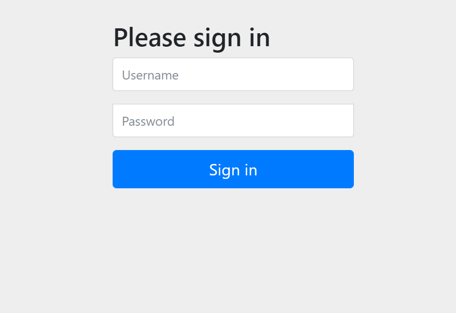

# 1. SpringBoot整合MybatisPlus

## 1.1 准备数据库脚本

~~~sql

CREATE TABLE If Not Exists user
(
    id BIGINT(20) NOT NULL COMMENT '主键ID',
    name VARCHAR(30) NULL DEFAULT NULL COMMENT '姓名',
    age INT(11) NULL DEFAULT NULL COMMENT '年龄',
    email VARCHAR(50) NULL DEFAULT NULL COMMENT '邮箱',
    PRIMARY KEY (id)
);


replace into user (id,name, age, email) VALUES
(1, 'Jone', 18, 'test1@mszlu.com'),
(2, 'Jack', 20, 'test2@mszlu.com'),
(3, 'Tom', 28, 'test3@mszlu.com'),
(4, 'Sandy', 21, 'test4@mszlu.com'),
(5, 'Billie', 24, 'test5@mszlu.com');
~~~

## 1.2 新建SpringBoot工程

### 1.2.1 依赖

~~~xml
<?xml version="1.0" encoding="UTF-8"?>
<project xmlns="http://maven.apache.org/POM/4.0.0"
         xmlns:xsi="http://www.w3.org/2001/XMLSchema-instance"
         xsi:schemaLocation="http://maven.apache.org/POM/4.0.0 http://maven.apache.org/xsd/maven-4.0.0.xsd">
    <modelVersion>4.0.0</modelVersion>

    <groupId>com.mszlu</groupId>
    <artifactId>union</artifactId>
    <version>1.0-SNAPSHOT</version>

    <parent>
        <groupId>org.springframework.boot</groupId>
        <artifactId>spring-boot-starter-parent</artifactId>
        <version>2.5.0</version>
    </parent>

    <dependencies>
        <dependency>
            <groupId>org.springframework.boot</groupId>
            <artifactId>spring-boot-starter-web</artifactId>
        </dependency>
        <dependency>
            <groupId>com.baomidou</groupId>
            <artifactId>mybatis-plus-boot-starter</artifactId>
            <version>3.4.3</version>
        </dependency>
        <dependency>
            <groupId>org.springframework.boot</groupId>
            <artifactId>spring-boot-starter-test</artifactId>
            <scope>test</scope>
        </dependency>
        <dependency>
            <groupId>mysql</groupId>
            <artifactId>mysql-connector-java</artifactId>
        </dependency>
         <dependency>
            <groupId>org.projectlombok</groupId>
            <artifactId>lombok</artifactId>
        </dependency>
    </dependencies>
</project>
~~~

### 1.2.2配置

~~~properties
spring.datasource.driver-class-name=com.mysql.cj.jdbc.Driver
spring.datasource.username=root
spring.datasource.password=root
spring.datasource.url=jdbc:mysql://localhost:3306/springboot?useUnicode=true&characterEncoding=UTF-8&serverTimeZone=UTC
#数据库 默认采用的数据源HikariDataSource

#sql脚本初始化 2.5.0
#DataSourceInitializationConfiguration 源码中得知不能写username和password，但好多文档说要写
#spring.sql.init.username=root
#spring.sql.init.password=root
spring.sql.init.schema-locations=classpath*:sql/*.sql
spring.sql.init.data-locations=classpath*:sql/data/*.sql


~~~

### 1.2.3 启动测试

~~~java
package com.mszlu.union;

import org.springframework.boot.SpringApplication;
import org.springframework.boot.autoconfigure.SpringBootApplication;

@SpringBootApplication
public class App {

    public static void main(String[] args) {
        SpringApplication.run(App.class,args);
    }
}

~~~


## 1.3 MybatisPlus

### 1.3.1 Mapper接口

~~~java
package com.mszlu.union.mapper;

import com.baomidou.mybatisplus.core.mapper.BaseMapper;
import com.mszlu.union.pojo.User;

public interface UserMapper extends BaseMapper<User> {
}

~~~

~~~java
package com.mszlu.union.config;

import com.baomidou.mybatisplus.extension.plugins.MybatisPlusInterceptor;
import com.baomidou.mybatisplus.extension.plugins.inner.PaginationInnerInterceptor;
import org.mybatis.spring.annotation.MapperScan;
import org.springframework.context.annotation.Bean;
import org.springframework.context.annotation.Configuration;

@Configuration
@MapperScan("com.mszlu.union.mapper")
public class MybatisPlusConfig {

    @Bean
    public MybatisPlusInterceptor mybatisPlusInterceptor(){
        MybatisPlusInterceptor mybatisPlusInterceptor = new MybatisPlusInterceptor();
        mybatisPlusInterceptor.addInnerInterceptor(new PaginationInnerInterceptor());
        return mybatisPlusInterceptor;
    }
}

~~~


### 1.3.2 Service代码

~~~java
package com.mszlu.union.service;

import com.baomidou.mybatisplus.core.conditions.query.LambdaQueryWrapper;
import com.baomidou.mybatisplus.extension.conditions.query.LambdaQueryChainWrapper;
import com.baomidou.mybatisplus.extension.plugins.pagination.Page;
import com.mszlu.union.mapper.UserMapper;
import com.mszlu.union.pojo.User;
import lombok.extern.slf4j.Slf4j;
import org.springframework.beans.factory.annotation.Autowired;
import org.springframework.stereotype.Service;

import java.util.List;

@Service
@Slf4j
public class UserService {

    @Autowired
    private UserMapper userMapper;

    public List<User> findAll(){

        LambdaQueryWrapper<User> queryWrapper = new LambdaQueryWrapper<>();

        List<User> users = userMapper.selectList(queryWrapper);
        return users;
    }
	//分页
    public List<User> findPage(){

        LambdaQueryWrapper<User> queryWrapper = new LambdaQueryWrapper<>();
        Page page = new Page(2,2);
        Page<User> userPage = userMapper.selectPage(page,queryWrapper);
        log.info("total:{}",userPage.getTotal());
        log.info("pages:{}",userPage.getPages());
        return userPage.getRecords();
    }
}

~~~


### 1.3.3 测试

~~~java
package com.mszlu.union.controller;

import com.mszlu.union.pojo.User;
import com.mszlu.union.service.UserService;
import org.springframework.beans.factory.annotation.Autowired;
import org.springframework.web.bind.annotation.GetMapping;
import org.springframework.web.bind.annotation.RequestMapping;
import org.springframework.web.bind.annotation.RestController;

import java.util.List;

@RestController
@RequestMapping("user")
public class UserController {

    @Autowired
    private UserService userService;

    @GetMapping("findAll")
    public List<User> findAll(){
        return userService.findAll();
    }
    @GetMapping("findPage")
    public List<User> findPage(){
        return userService.findPage();
    }
}

~~~


# 2. SpringBoot整合ShardingSphere

http://shardingsphere.apache.org/index_zh.html

## 2.1 导入依赖

~~~xml
<dependency>
    <groupId>org.apache.shardingsphere</groupId>
    <artifactId>shardingsphere-jdbc-core-spring-boot-starter</artifactId>
    <version>5.0.0-alpha</version>
</dependency>
~~~


## 2.2 配置读写分离

~~~properties
##shardingsphere配置
spring.shardingsphere.datasource.common.type=com.zaxxer.hikari.HikariDataSource
spring.shardingsphere.datasource.common.driver-class-name=com.mysql.cj.jdbc.Driver
spring.shardingsphere.datasource.common.username=root
spring.shardingsphere.datasource.common.password= root


spring.shardingsphere.datasource.names=master,slave0,slave1

# 配置第 1 个数据源
spring.shardingsphere.datasource.master.type=com.zaxxer.hikari.HikariDataSource
spring.shardingsphere.datasource.master.driver-class-name=com.mysql.cj.jdbc.Driver
spring.shardingsphere.datasource.master.jdbc-url=jdbc:mysql://localhost:3306/springboot?useUnicode=true&characterEncoding=UTF-8&serverTimeZone=UTC
spring.shardingsphere.datasource.master.username=root
spring.shardingsphere.datasource.master.password=root

# 配置第 2 个数据源
spring.shardingsphere.datasource.slave0.type=com.zaxxer.hikari.HikariDataSource
spring.shardingsphere.datasource.slave0.driver-class-name=com.mysql.cj.jdbc.Driver
spring.shardingsphere.datasource.slave0.jdbc-url=jdbc:mysql://localhost:3306/springboot?useUnicode=true&characterEncoding=UTF-8&serverTimeZone=UTC
spring.shardingsphere.datasource.slave0.username=root
spring.shardingsphere.datasource.slave0.password=root
# 配置第 3 个数据源
spring.shardingsphere.datasource.slave1.type=com.zaxxer.hikari.HikariDataSource
spring.shardingsphere.datasource.slave1.driver-class-name=com.mysql.cj.jdbc.Driver
spring.shardingsphere.datasource.slave1.jdbc-url=jdbc:mysql://localhost:3306/springboot?useUnicode=true&characterEncoding=UTF-8&serverTimeZone=UTC
spring.shardingsphere.datasource.slave1.username=root
spring.shardingsphere.datasource.slave1.password=root

# 主数据源名称
spring.shardingsphere.rules.replica-query.data-sources.ms.primary-data-source-name=master
# 从数据源名称，多个从数据源用逗号分隔
spring.shardingsphere.rules.replica-query.data-sources.ms.replica-data-source-names=slave0,slave1 
# 负载均衡算法名称
spring.shardingsphere.rules.replica-query.data-sources.ms.load-balancer-name=round-robin

## 负载均衡算法配置
spring.shardingsphere.rules.replica-query.load-balancers.round-robin.type=ROUND_ROBIN
## 负载均衡算法属性配置
spring.shardingsphere.rules.replica-query.load-balancers.round-robin.props.workId=1
#打印sql
spring.shardingsphere.props.sql-show=true
~~~


## 2.3 配置分表

### 2.3.1 准备表

~~~sql
CREATE TABLE If Not Exists user_0
(
    id BIGINT(20) NOT NULL COMMENT '主键ID',
    name VARCHAR(30) NULL DEFAULT NULL COMMENT '姓名',
    age INT(11) NULL DEFAULT NULL COMMENT '年龄',
    email VARCHAR(50) NULL DEFAULT NULL COMMENT '邮箱',
    PRIMARY KEY (id)
);
CREATE TABLE If Not Exists user_1
(
    id BIGINT(20) NOT NULL COMMENT '主键ID',
    name VARCHAR(30) NULL DEFAULT NULL COMMENT '姓名',
    age INT(11) NULL DEFAULT NULL COMMENT '年龄',
    email VARCHAR(50) NULL DEFAULT NULL COMMENT '邮箱',
    PRIMARY KEY (id)
);
CREATE TABLE If Not Exists user_2
(
    id BIGINT(20) NOT NULL COMMENT '主键ID',
    name VARCHAR(30) NULL DEFAULT NULL COMMENT '姓名',
    age INT(11) NULL DEFAULT NULL COMMENT '年龄',
    email VARCHAR(50) NULL DEFAULT NULL COMMENT '邮箱',
    PRIMARY KEY (id)
);

~~~

### 2.3.2 配置

~~~properties
## 分表
spring.shardingsphere.rules.sharding.binding-tables=user
# 标准分片表配置
# 由数据源名 + 表名组成，以小数点分隔。多个表以逗号分隔，支持inline表达式。缺省表示使用已知数据源与逻辑表名称生成数据节点，用于广播表（即每个库中都需要一个同样的表用于关联查询，多为字典表）或只分库不分表且所有库的表结构完全一致的情况
#ms是上面 读写分离的配置
spring.shardingsphere.rules.sharding.tables.user.actual-data-nodes=ms.user_$->{0..2}

# 用于单分片键的标准分片场景
# 分片列名称
spring.shardingsphere.rules.sharding.tables.user.table-strategy.standard.sharding-column=id
# 分片算法名称
spring.shardingsphere.rules.sharding.tables.user.table-strategy.standard.sharding-algorithm-name=table-inline

#雪花算法 分布式id
spring.shardingsphere.rules.sharding.key-generators.snowflake.type=SNOWFLAKE
spring.shardingsphere.rules.sharding.key-generators.snowflake.props.worker-id=123

spring.shardingsphere.rules.sharding.sharding-algorithms.table-inline.type=INLINE
spring.shardingsphere.rules.sharding.sharding-algorithms.table-inline.props.algorithm-expression=user_$->{id % 3}

spring.shardingsphere.enabled=true
~~~


# 3. SpringBoot整合Redis

## 3.1 安装Redis并启动

~~~shell
#docker安装
curl -sSL https://get.daocloud.io/docker | sh
#拉取
docker pull redis:latest
#创建容器并启动
docker run -p 6379:6379 --name redis -v /usr/local/docker/redis/redis.conf:/opt/docker/redis/redis.conf -v /usr/local/docker/redis/data:/opt/docker/redis/data -d redis redis-server /opt/docker/redis/redis.conf --appendonly yes

#-p 6379:6379 端口映射：前表示主机部分，：后表示容器部分。

# --name redis  指定该容器名称，查看和进行操作都比较方便。

# -v 挂载目录，规则与端口映射相同。

# -d redis 表示后台启动redis

# redis-server /opt/docker/redis/redis.conf  #以配置文件启动redis，加载容器内的conf文件，最终找到的是挂载的目录/usr/local/docker/redis/redis.conf
docker start redis
#进入容器
docker exec -it redis /bin/bash
#验证
redis-cli
~~~

## 3.2 SpringBoot添加Redis的配置并导入依赖

~~~xml
  <dependency>
            <groupId>org.springframework.boot</groupId>
            <artifactId>spring-boot-starter-data-redis</artifactId>
        </dependency>
~~~

~~~properties
## redis配置
spring.redis.port=6379
spring.redis.host=192.168.200.100
~~~


## 3.3 使用

~~~xml
 <dependency>
            <groupId>org.apache.commons</groupId>
            <artifactId>commons-lang3</artifactId>
        </dependency>
        <dependency>
            <groupId>com.alibaba</groupId>
            <artifactId>fastjson</artifactId>
            <version>1.2.76</version>
        </dependency>
~~~

对之前的findAll代码 做一个缓存

~~~java
 @Autowired
    private RedisTemplate<String,String> redisTemplate;

    public List<User> findAll(){
        String userListJsonStr = redisTemplate.opsForValue().get("UserService.findAll");
        if (StringUtils.isNotBlank(userListJsonStr)){
            List<User> users = JSON.parseArray(userListJsonStr, User.class);
            log.info("走了缓存~~~");
            return users;
        }else {
            //查询所有
            List<User> users = userMapper.selectList(new LambdaQueryWrapper<>());
            redisTemplate.opsForValue().set("UserService.findAll",JSON.toJSONString(users),2, TimeUnit.HOURS);
            log.info("存入缓存~~~");
            return users;
        }
    }
~~~


# 4. SpringBoot整合RocketMQ

- RocketMQ是由阿里捐赠给Apache的一款低延迟、高并发、高可用、高可靠的分布式消息中间件。经历了淘宝双十一的洗礼。RocketMQ既可为分布式应用系统提供异步解耦和削峰填谷的能力，同时也具备互联网应用所需的海量消息堆积、高吞吐、可靠重试等特性。

## 4.1 安装 rocketmq

~~~shell
#docker 拉取
docker pull foxiswho/rocketmq:4.8.0
#启动nameserver
docker run -d -v /usr/local/rocketmq/logs:/opt/docker/rocketmq/logs \
      --name rmqnamesrv \
      -e "JAVA_OPT_EXT=-Xms512M -Xmx512M -Xmn128m" \
      -p 9876:9876 \
      foxiswho/rocketmq:4.8.0 \
      sh mqnamesrv
#broker.conf
brokerIP1=192.168.200.100
namesrvAddr=192.168.200.100:9876
brokerName=broker_all
#启动broker
docker run -d  -v /opt/docker/rocketmq/logs:/usr/local/rocketmq/logs -v /opt/docker/rocketmq/store:/usr/local/rocketmq/store \
      -v /opt/docker/rocketmq/conf:/usr/local/rocketmq/conf \
      --name rmqbroker \
      -e "NAMESRV_ADDR=192.168.200.100:9876" \
      -e "JAVA_OPT_EXT=-Xms512M -Xmx512M -Xmn128m" \
      -p 10911:10911 -p 10912:10912 -p 10909:10909 \
      foxiswho/rocketmq:4.8.0 \
      sh mqbroker -c /usr/local/rocketmq/conf/broker.conf
#rocketmq-console-ng
docker run --name rmqconsole --link rmqnamesrv:rmqnamesrv \
-e "JAVA_OPTS=-Drocketmq.namesrv.addr=192.168.200.100:9876 -Dcom.rocketmq.sendMessageWithVIPChannel=false" \
-p 8180:8080 -t styletang/rocketmq-console-ng

#启动访问 http://192.168.200.100:8180/

~~~


## 4.2 整合

### 4.2.1 导入依赖

~~~xml
	<dependency>
            <groupId>org.apache.rocketmq</groupId>
            <artifactId>rocketmq-client</artifactId>
            <version>4.8.0</version>
        </dependency>
        <dependency>
            <groupId>org.apache.rocketmq</groupId>
            <artifactId>rocketmq-spring-boot-starter</artifactId>
            <version>2.2.0</version>
        </dependency>
~~~

### 4.2.2 写配置

~~~properties
#rocketmq配置
rocketmq.name-server=192.168.200.100:9876
rocketmq.producer.group=springboot_group
~~~

### 4.2.3 代码

~~~java
//生产者
 	@Autowired
    private RocketMQTemplate rocketMQTemplate;

	public void send(){
        User user = this.findById(1L);
        rocketMQTemplate.convertAndSend("topic_springboot",user);
    }
~~~

~~~java
//消费者
package com.mszlu.union.service.consumer;

import lombok.extern.slf4j.Slf4j;
import org.apache.rocketmq.spring.annotation.RocketMQMessageListener;
import org.apache.rocketmq.spring.core.RocketMQListener;
import org.springframework.stereotype.Component;

@Component
@RocketMQMessageListener(topic = "topic_springboot",consumerGroup = "group1")
@Slf4j
public class UserConsumer implements RocketMQListener<String> {
    @Override
    public void onMessage(String msg) {
        log.info("msg:{}",msg);
    }
}

~~~


# 5. SpringBoot整合ES

## 5.1 安装ES

Elasticsearch是一个基于[Lucene](https://baike.baidu.com/item/Lucene/6753302)的搜索服务器。它提供了一个分布式多用户能力的[全文搜索引擎](https://baike.baidu.com/item/全文搜索引擎/7847410)

https://docs.spring.io/spring-data/elasticsearch/docs/4.2.1/reference/html/#new-features

看官方的对应版本。

~~~shell
#下载es的镜像
docker pull elasticsearch:7.12.1
#创建es的容器 并启动  single-node单机
docker run -d --name es -p 9200:9200 -p 9300:9300 -e "discovery.type=single-node" elasticsearch:7.12.1
#测试
http://192.168.200.100:9200/
#下载kibana的镜像
docker pull kibana:7.12.1
#准备kibana的配置文件
docker inspect es的容器id（docker ps -a 查看）
# 找到  "IPAddress": "172.17.0.2" 找出es对应的容器ip地址
# Default Kibana configuration for docker target
server.name: kibana
server.host: "0"
elasticsearch.hosts: [ "http://172.17.0.2:9200" ]
xpack.monitoring.ui.container.elasticsearch.enabled: true

#启动kibana
docker run -d --restart=always --log-driver json-file --log-opt max-size=100m --log-opt max-file=2 --name kibana -p 5601:5601 -v /opt/docker/es/kibana.yml:/usr/share/kibana/config/kibana.yml kibana:7.12.1
#测试
http://192.168.200.100:5601/
#命令
GET /_search #获取所有数据
~~~

~~~js
 PUT /ecommerce/product/1
  {
      "name" : "gaolujie yagao",
      "desc" :  "gaoxiao meibai",
      "price" :  30,
      "producer" :      "gaolujie producer",
      "tags": [ "meibai", "fangzhu" ]
  }
GET /ecommerce/product/1
POST /ecommerce/product/1/_update
{
    "doc" : {
        "name" : "佳洁士牙膏"
    }
}
DELETE /ecommerce/product/1
~~~


## 5.2 整合

### 5.2.1 添加依赖

~~~xml
<dependency>
    <groupId>org.springframework.boot</groupId>
    <artifactId>spring-boot-starter-data-elasticsearch</artifactId>
</dependency>

~~~

### 5.2.2 常用注解

~~~java
//标示映射到Elasticsearch文档上的领域对象
public @interface Document {
  //索引库名次，mysql中数据库的概念
    String indexName();
  //文档类型，mysql中表的概念
    String type() default "";
  //默认分片数
    short shards() default 5;
  //默认副本数量
    short replicas() default 1;

}

~~~

~~~java
//表示是文档的id，文档可以认为是mysql中主键的概念
  public @interface Id {
  }
~~~

~~~java
public @interface Field {
    //文档中字段的类型
      FieldType type() default FieldType.Auto;
    //是否建立倒排索引
      boolean index() default true;
    //是否进行存储
      boolean store() default false;
    //分词器名次
      String analyzer() default "";
  }
~~~

~~~java
//为文档自动指定元数据类型
  public enum FieldType {
      Text,//会进行分词并建了索引的字符类型
      Integer,
      Long,
      Date,
      Float,
      Double,
      Boolean,
      Object,
      Auto,//自动判断字段类型
      Nested,//嵌套对象类型
      Ip,
      Attachment,
      Keyword//不会进行分词建立索引的类型
  }

~~~

### 5.2.3 写配置

~~~properties
#es的配置
spring.elasticsearch.rest.uris=http://192.168.200.100:9200
spring.data.elasticsearch.repositories.enabled=true
spring.data.elasticsearch.client.reactive.endpoints=192.168.200.100:9200
~~~

### 5.2.4 代码

~~~java
package com.mszlu.union.domain.repository;

import com.mszlu.union.model.es.Article;
import org.springframework.data.domain.Page;
import org.springframework.data.domain.Pageable;
import org.springframework.data.elasticsearch.annotations.Query;
import org.springframework.data.elasticsearch.repository.ElasticsearchRepository;
import org.springframework.stereotype.Repository;

@Repository
public interface ArticleRepository extends ElasticsearchRepository<Article,String> {

    //根据作者名称 搜索
    Page<Article> findByAuthorsName(String name, Pageable pageable);

    //搜索title字段
    Page<Article> findByTitleIsContaining(String word,Pageable pageable);
    
    Page<Article> findByTitle(String title,Pageable pageable);
}
~~~


~~~java
package com.mszlu.union.model.es;

import lombok.Data;
import org.springframework.data.annotation.Id;
import org.springframework.data.elasticsearch.annotations.Document;
import org.springframework.data.elasticsearch.annotations.Field;
import org.springframework.data.elasticsearch.annotations.FieldType;

import java.util.List;

//注意indexName要小写
@Document(indexName = "blog")
@Data
public class Article {
    @Id
    private String id;
    private String title;
    @Field(type = FieldType.Nested, includeInParent = true)
    private List<Author> authors;

    public Article(String title) {
        this.title = title;
    }
}


~~~

~~~java
public class Author {
    private String name;
    public Author(String name) {
        this.name = name;
    }
}
~~~

~~~java
package com.mszlu.union.service;

import com.alibaba.fastjson.JSON;
import com.mszlu.union.domain.repository.ArticleRepository;
import com.mszlu.union.model.es.Article;
import com.mszlu.union.model.es.Author;
import org.checkerframework.checker.units.qual.A;
import org.junit.jupiter.api.Test;
import org.springframework.beans.factory.annotation.Autowired;
import org.springframework.boot.test.context.SpringBootTest;
import org.springframework.data.domain.Page;
import org.springframework.data.domain.PageRequest;
import org.springframework.data.elasticsearch.core.ElasticsearchRestTemplate;
import org.springframework.data.elasticsearch.core.ElasticsearchTemplate;
import org.springframework.data.elasticsearch.core.SearchHits;
import org.springframework.data.elasticsearch.core.mapping.IndexCoordinates;
import org.springframework.data.elasticsearch.core.query.NativeSearchQueryBuilder;
import org.springframework.data.elasticsearch.core.query.Query;

import java.util.Arrays;

import static java.util.Arrays.asList;
import static org.elasticsearch.index.query.QueryBuilders.regexpQuery;

@SpringBootTest
public class ESTest {

    @Autowired
    private ArticleRepository articleRepository;
    //新增
    @Test
    public void save(){
        Article article = new Article("Spring Data Elasticsearch");
        article.setAuthors(asList(new Author("god"),new Author("John")));
        articleRepository.save(article);

        article = new Article("Spring Data Elasticsearch2");
        article.setAuthors(asList(new Author("god"),new Author("King")));
        articleRepository.save(article);

        article = new Article("Spring Data Elasticsearch3");
        article.setAuthors(asList(new Author("god"),new Author("Bill")));
        articleRepository.save(article);
    }
    @Test
    public void queryAuthorName()  {
        Page<Article> articles = articleRepository.findByAuthorsName("chali", PageRequest.of(0,10));
        for (Article article : articles.getContent()) {
            System.out.println(article);
            for (Author author : article.getAuthors()) {
                System.out.println(author);
            }
        }
    }
    @Test
    public void update() {
        Page<Article> articles = articleRepository.findByTitle("Spring Data Elasticsearch",PageRequest.of(0,10));

        Article article = articles.getContent().get(0);
        System.out.println(article);
        System.out.println(article.getAuthors().get(0));
        Author author = new Author("chali");
        article.setAuthors(Arrays.asList(author));
        articleRepository.save(article);
    }

    @Test
    public void delete(){
        Page<Article> articles = articleRepository.findByTitle("Spring Data Elasticsearch",PageRequest.of(0,10));
        Article article = articles.getContent().get(0);
        articleRepository.delete(article);
    }

    @Autowired
    private ElasticsearchRestTemplate elasticsearchRestTemplate;
    //使用Template进行关键字查询
    //关于正则表达式可以参考https://www.runoob.com/java/java-regular-expressions.html
    //.*data.* 可以匹配ddata, dataa等
    @Test
    void queryTileContainByTemplate()  {
        Query query = new NativeSearchQueryBuilder().withFilter(regexpQuery("title",".*elasticsearch2.*")).build();
        SearchHits<Article> articles = elasticsearchRestTemplate.search(query, Article.class, IndexCoordinates.of("blog"));
        System.out.println(JSON.toJSONString(articles));
    }

}

~~~

### 5.2.5 ElasticsearchRepository

| 关键字              | 使用示例                           | 等同于的ES查询                                               |
| :------------------ | :--------------------------------- | :----------------------------------------------------------- |
| And                 | findByNameAndPrice                 | {“bool” : {“must” : [ {“field” : {“name” : “?”}}, {“field” : {“price” : “?”}} ]}} |
| Or                  | findByNameOrPrice                  | {“bool” : {“should” : [ {“field” : {“name” : “?”}}, {“field” : {“price” : “?”}} ]}} |
| Is                  | findByName                         | {“bool” : {“must” : {“field” : {“name” : “?”}}}}             |
| Not                 | findByNameNot                      | {“bool” : {“must_not” : {“field” : {“name” : “?”}}}}         |
| Between             | findByPriceBetween                 | {“bool” : {“must” : {“range” : {“price” : {“from” : ?,”to” : ?,”include_lower” : true,”include_upper” : true}}}}} |
| LessThanEqual       | findByPriceLessThan                | {“bool” : {“must” : {“range” : {“price” : {“from” : null,”to” : ?,”include_lower” : true,”include_upper” : true}}}}} |
| GreaterThanEqual    | findByPriceGreaterThan             | {“bool” : {“must” : {“range” : {“price” : {“from” : ?,”to” : null,”include_lower” : true,”include_upper” : true}}}}} |
| Before              | findByPriceBefore                  | {“bool” : {“must” : {“range” : {“price” : {“from” : null,”to” : ?,”include_lower” : true,”include_upper” : true}}}}} |
| After               | findByPriceAfter                   | {“bool” : {“must” : {“range” : {“price” : {“from” : ?,”to” : null,”include_lower” : true,”include_upper” : true}}}}} |
| Like                | findByNameLike                     | {“bool” : {“must” : {“field” : {“name” : {“query” : “? *”,”analyze_wildcard” : true}}}}} |
| StartingWith        | findByNameStartingWith             | {“bool” : {“must” : {“field” : {“name” : {“query” : “? *”,”analyze_wildcard” : true}}}}} |
| EndingWith          | findByNameEndingWith               | {“bool” : {“must” : {“field” : {“name” : {“query” : “*?”,”analyze_wildcard” : true}}}}} |
| Contains/Containing | findByNameContaining               | {“bool” : {“must” : {“field” : {“name” : {“query” : “?”,”analyze_wildcard” : true}}}}} |
| In                  | findByNameIn(Collectionnames)      | {“bool” : {“must” : {“bool” : {“should” : [ {“field” : {“name” : “?”}}, {“field” : {“name” : “?”}} ]}}}} |
| NotIn               | findByNameNotIn(Collectionnames)   | {“bool” : {“must_not” : {“bool” : {“should” : {“field” : {“name” : “?”}}}}}} |
| True                | findByAvailableTrue                | {“bool” : {“must” : {“field” : {“available” : true}}}}       |
| False               | findByAvailableFalse               | {“bool” : {“must” : {“field” : {“available” : false}}}}      |
| OrderBy             | findByAvailableTrueOrderByNameDesc | {“sort” : [{ “name” : {“order” : “desc”} }],”bool” : {“must” : {“field” : {“available” : true}}}} |

# 6. SpringBoot整合SpringSecurity

Spring Security 是 Spring 家族中的一个安全管理框架，提供了权限的解决方案，通过一些简单的配置以及代码，就可以轻松实现。

安全：认证+授权

## 6.1 导入依赖

~~~xml
<dependency>
    <groupId>org.springframework.boot</groupId>
    <artifactId>spring-boot-starter-security</artifactId>
</dependency>
~~~

## 6.2 启动访问接口

 ~~~java
//启动会在控制台出现
Using generated security password: 98687887-01bf-41b5-bb6e-63009367be0f
 ~~~

同时访问http://localhost:8080/user/findAll ,会出现一个登陆页面


这时候，用户名输入user，密码输入上方控制台打印的密码，即可登录，并且正常访问接口。

## 6.3 登录的用户名/密码

对登录的用户名/密码进行配置，有三种不同的方式：

1. 在 application.properties 中进行配置

   ~~~properties
   spring.security.user.name=admin
   spring.security.user.password=mszlu
   ~~~

2. 通过 Java 代码配置在内存中

   ~~~java
   package com.mszlu.union.config;
   
   import org.springframework.context.annotation.Bean;
   import org.springframework.context.annotation.Configuration;
   import org.springframework.security.config.annotation.authentication.builders.AuthenticationManagerBuilder;
   import org.springframework.security.config.annotation.web.configuration.WebSecurityConfigurerAdapter;
   import org.springframework.security.crypto.bcrypt.BCryptPasswordEncoder;
   import org.springframework.security.crypto.password.PasswordEncoder;
   
   @Configuration
   public class SecurityConfig extends WebSecurityConfigurerAdapter {
       @Override
       protected void configure(AuthenticationManagerBuilder auth) throws Exception {
           //下面这两行配置表示在内存中配置了两个用户
           auth.inMemoryAuthentication()
                   .withUser("admin").roles("admin").password("$2a$10$2UaOufuypWR1TASuso2S6.u6TGL7nuAGCsb4RZ5X2SMEuelwQBToO")
                   .and()
                   .withUser("user").roles("user").password("$2a$10$2UaOufuypWR1TASuso2S6.u6TGL7nuAGCsb4RZ5X2SMEuelwQBToO");
       }
       @Bean
       PasswordEncoder passwordEncoder() {
           return new BCryptPasswordEncoder();
       }
   
       public static void main(String[] args) {
           String mszlu = new BCryptPasswordEncoder().encode("mszlu");
           System.out.println(mszlu);
       }
   }
   ~~~

   

3. 通过 Java 从数据库中加载

## 6.4 登录配置

~~~java

    @Override
    protected void configure(HttpSecurity http) throws Exception {
        http.authorizeRequests() //开启登录认证
                .antMatchers("/user/findAll").hasRole("admin") //访问接口需要admin的角色
                .antMatchers("/login").permitAll()
                .anyRequest().authenticated() // 其他所有的请求 只需要登录即可
                .and().formLogin()
                .loginPage("/login.html") //自定义的登录页面
                .loginProcessingUrl("/login") //登录处理接口
                .usernameParameter("username") //定义登录时的用户名的key 默认为username
                .passwordParameter("password") //定义登录时的密码key，默认是password
                .successHandler(new AuthenticationSuccessHandler() {
                    @Override
                    public void onAuthenticationSuccess(HttpServletRequest httpServletRequest, HttpServletResponse httpServletResponse, Authentication authentication) throws IOException, ServletException {
                        httpServletResponse.setContentType("application/json;charset=utf-8");
                        PrintWriter out = httpServletResponse.getWriter();
                        out.write("success");
                        out.flush();
                    }
                }) //登录成功处理器
                .failureHandler(new AuthenticationFailureHandler() {
                    @Override
                    public void onAuthenticationFailure(HttpServletRequest httpServletRequest, HttpServletResponse httpServletResponse, AuthenticationException e) throws IOException, ServletException {
                        httpServletResponse.setContentType("application/json;charset=utf-8");
                        PrintWriter out = httpServletResponse.getWriter();
                        out.write("fail");
                        out.flush();
                    }
                }) //登录失败处理器
        .permitAll() //通过 不拦截，更加前面配的路径决定，这是指和登录表单相关的接口 都通过
        .and().logout() //退出登录配置
        .logoutUrl("/logout") //退出登录接口
        .logoutSuccessHandler(new LogoutSuccessHandler() {
            @Override
            public void onLogoutSuccess(HttpServletRequest httpServletRequest, HttpServletResponse httpServletResponse, Authentication authentication) throws IOException, ServletException {
                httpServletResponse.setContentType("application/json;charset=utf-8");
                PrintWriter out = httpServletResponse.getWriter();
                out.write("logout success");
                out.flush();
            }
        }) //退出登录成功 处理器
        .permitAll() //退出登录的接口放行
        .and()
        .httpBasic()
        .and()
        .csrf().disable(); //csrf关闭 如果自定义登录 需要关闭

    }

~~~

### 6.4.1 自定义登录

~~~html
<!DOCTYPE html>
<html lang="en">
<head>
    <meta charset="UTF-8">
    <title>自定义登录页面</title>
    <!-- 引入样式 -->
    <link rel="stylesheet" href="https://unpkg.com/element-ui/lib/theme-chalk/index.css">
</head>
<body>
<div id="app">
    用户名： <el-input v-model="username" placeholder="请输入内容"></el-input>
    密码：  <el-input v-model="password" placeholder="请输入内容"></el-input>
           <el-button type="success" @click="login()">提交</el-button>
</div>
<!-- 引入组件库 -->
<script src="https://cdn.jsdelivr.net/npm/vue/dist/vue.js"></script>
<script src="https://unpkg.com/element-ui/lib/index.js"></script>
<script src="https://unpkg.com/axios/dist/axios.min.js"></script>

<script>
    new Vue({
        el: "#app",
        data:{
            username:"",
            password:""
        },
        methods:{
            login(){
                    axios.post("/login?username="+this.username+"&password="+this.password).then((res)=>{
                        if (res.data == "success"){
                            this.$message.success("登录成功");
                        }else{
                            this.$message.error("用户名或密码错误");
                        }
                    })
            }
        }
    });
</script>
</body>
</html>
~~~


## 6.5 数据库访问认证和授权

### 6.5.1 登录认证

1. 表结构

   ~~~sql
   CREATE TABLE `admin_user`  (
     `id` bigint(0) NOT NULL AUTO_INCREMENT,
     `username` varchar(255) CHARACTER SET utf8mb4 COLLATE utf8mb4_unicode_ci NOT NULL,
     `password` varchar(255) CHARACTER SET utf8mb4 COLLATE utf8mb4_unicode_ci NOT NULL,
     `create_time` bigint(0) NOT NULL,
     PRIMARY KEY (`id`) USING BTREE
   ) ENGINE = InnoDB CHARACTER SET = utf8mb4 COLLATE = utf8mb4_unicode_ci ROW_FORMAT = Dynamic;
   
   INSERT INTO `admin_user`(`id`, `username`, `password`, `create_time`) VALUES (1, 'admin', '$2a$10$2UaOufuypWR1TASuso2S6.u6TGL7nuAGCsb4RZ5X2SMEuelwQBToO', 1622711132975);
   
   ~~~

   ~~~java
   package com.mszlu.union.pojo;
   
   import lombok.Data;
   
   @Data
   public class AdminUser {
   
       private  Long id;
   
       private String username;
   
       private String password;
   
       private Long createTime;
   }
   
   ~~~

   ~~~java
   package com.mszlu.union.mapper;
   
   import com.baomidou.mybatisplus.core.mapper.BaseMapper;
   import com.mszlu.union.pojo.AdminUser;
   
   public interface AdminUserMapper extends BaseMapper<AdminUser> {
   }
   
   ~~~

   

2. 实现UserDetailService接口

   ~~~java
   package com.mszlu.union.security;
   
   import com.baomidou.mybatisplus.core.conditions.query.LambdaQueryWrapper;
   import com.mszlu.union.mapper.AdminUserMapper;
   import com.mszlu.union.pojo.AdminUser;
   import org.springframework.beans.factory.annotation.Autowired;
   import org.springframework.security.core.GrantedAuthority;
   import org.springframework.security.core.userdetails.User;
   import org.springframework.security.core.userdetails.UserDetails;
   import org.springframework.security.core.userdetails.UserDetailsService;
   import org.springframework.security.core.userdetails.UsernameNotFoundException;
   import org.springframework.stereotype.Component;
   
   import java.util.ArrayList;
   import java.util.List;
   
   @Component
   public class SecurityUserService implements UserDetailsService {
       @Autowired
       private AdminUserMapper adminUserMapper;
       @Override
       public UserDetails loadUserByUsername(String username) throws UsernameNotFoundException {
           LambdaQueryWrapper<AdminUser> queryWrapper = new LambdaQueryWrapper<>();
           queryWrapper.eq(AdminUser::getUsername,username).last("limit 1");
           AdminUser adminUser = this.adminUserMapper.selectOne(queryWrapper);
           if (adminUser == null){
               throw new UsernameNotFoundException("用户名不存在");
           }
           List<GrantedAuthority> authorityList = new ArrayList<>();
           UserDetails userDetails = new User(username,adminUser.getPassword(),authorityList);
           return userDetails;
       }
   }
   
   ~~~

   

3. 在配置中添加使用UserDetailService

   ~~~java
       @Override
       protected void configure(HttpSecurity http) throws Exception {
           http.userDetailsService(securityUserService);
           //...
       }
   ~~~

4. 测试

### 6.5.2 授权

1. 权限相关表结构

   ~~~sql
   DROP TABLE IF EXISTS `role`;
   CREATE TABLE `role`  (
     `id` int(0) NOT NULL AUTO_INCREMENT,
     `role_name` varchar(255) CHARACTER SET utf8mb4 COLLATE utf8mb4_unicode_ci NOT NULL,
     `role_desc` varchar(255) CHARACTER SET utf8mb4 COLLATE utf8mb4_unicode_ci NOT NULL,
     `role_keyword` varchar(255) CHARACTER SET utf8mb4 COLLATE utf8mb4_unicode_ci NOT NULL,
     PRIMARY KEY (`id`) USING BTREE
   ) ENGINE = InnoDB CHARACTER SET = utf8mb4 COLLATE = utf8mb4_unicode_ci ROW_FORMAT = Dynamic;
   
   -- ----------------------------
   -- Records of role
   -- ----------------------------
   INSERT INTO `role` VALUES (1, '管理员', '管理员', 'ADMIN');
   INSERT INTO `role` VALUES (2, '运营', '运营部门', 'BUSINESS');
   
   DROP TABLE IF EXISTS `user_role`;
   CREATE TABLE `user_role`  (
     `id` bigint(0) NOT NULL AUTO_INCREMENT,
     `user_id` bigint(0) NOT NULL,
     `role_id` int(0) NOT NULL,
     PRIMARY KEY (`id`) USING BTREE,
     INDEX `user_id`(`user_id`) USING BTREE
   ) ENGINE = InnoDB CHARACTER SET = utf8mb4 COLLATE = utf8mb4_unicode_ci ROW_FORMAT = Dynamic;
   
   -- ----------------------------
   -- Records of user_role
   -- ----------------------------
   INSERT INTO `user_role` VALUES (1, 1, 1);
   ~~~

   ~~~java
   package com.mszlu.union.pojo;
   
   import lombok.Data;
   
   @Data
   public class Role {
       private Integer id;
   
       private String roleName;
   
       private String roleDesc;
   
       private String roleKeyword;
   }
   
   ~~~

   ~~~sql
   DROP TABLE IF EXISTS `permission`;
   CREATE TABLE `permission`  (
     `id` int(0) NOT NULL AUTO_INCREMENT,
     `name` varchar(255) CHARACTER SET utf8mb4 COLLATE utf8mb4_unicode_ci NOT NULL,
     `desc` varchar(255) CHARACTER SET utf8mb4 COLLATE utf8mb4_unicode_ci NOT NULL,
     `permission_keyword` varchar(255) CHARACTER SET utf8mb4 COLLATE utf8mb4_unicode_ci NOT NULL,
     `path` varchar(255) CHARACTER SET utf8mb4 COLLATE utf8mb4_unicode_ci NOT NULL,
     PRIMARY KEY (`id`) USING BTREE
   ) ENGINE = InnoDB CHARACTER SET = utf8mb4 COLLATE = utf8mb4_unicode_ci ROW_FORMAT = Dynamic;
   
   -- ----------------------------
   -- Records of permission
   -- ----------------------------
   INSERT INTO `permission` VALUES (1, '查询全部', '查询全部', 'USER_FINDALL', '/user/findAll');
   INSERT INTO `permission` VALUES (2, '年龄查询', '年龄查询', 'USER_FINDAGE', '/user/findAge');
   
   DROP TABLE IF EXISTS `role_permission`;
   CREATE TABLE `role_permission`  (
     `id` bigint(0) NOT NULL AUTO_INCREMENT,
     `role_id` int(0) NOT NULL,
     `permission_id` int(0) NOT NULL,
     PRIMARY KEY (`id`) USING BTREE,
     INDEX `role_id`(`role_id`) USING BTREE
   ) ENGINE = InnoDB CHARACTER SET = utf8mb4 COLLATE = utf8mb4_unicode_ci ROW_FORMAT = Dynamic;
   
   -- ----------------------------
   -- Records of role_permission
   -- ----------------------------
   INSERT INTO `role_permission` VALUES (1, 1, 1);
   ~~~

   ~~~java
   package com.mszlu.union.pojo;
   
   import lombok.Data;
   
   @Data
   public class Permission {
       private Integer id;
   
       private String name;
   
       private String desc;
   
       private String permissionKeyword;
   
       private String path;
   }
   
   ~~~

   

2. 在UserDetailService的接口实现中，查询用户的权限

   ~~~java
   package com.mszlu.union.security;
   
   import com.baomidou.mybatisplus.core.conditions.query.LambdaQueryWrapper;
   import com.mszlu.union.mapper.AdminUserMapper;
   import com.mszlu.union.mapper.PermissionMapper;
   import com.mszlu.union.mapper.RoleMapper;
   import com.mszlu.union.pojo.AdminUser;
   import com.mszlu.union.pojo.Permission;
   import com.mszlu.union.pojo.Role;
   import org.springframework.beans.factory.annotation.Autowired;
   import org.springframework.security.core.GrantedAuthority;
   import org.springframework.security.core.authority.SimpleGrantedAuthority;
   import org.springframework.security.core.userdetails.User;
   import org.springframework.security.core.userdetails.UserDetails;
   import org.springframework.security.core.userdetails.UserDetailsService;
   import org.springframework.security.core.userdetails.UsernameNotFoundException;
   import org.springframework.stereotype.Component;
   
   import java.util.ArrayList;
   import java.util.List;
   
   @Component
   public class SecurityUserService implements UserDetailsService {
       @Autowired
       private AdminUserMapper adminUserMapper;
       @Autowired
       private RoleMapper roleMapper;
       @Autowired
       private PermissionMapper permissionMapper;
       @Override
       public UserDetails loadUserByUsername(String username) throws UsernameNotFoundException {
           LambdaQueryWrapper<AdminUser> queryWrapper = new LambdaQueryWrapper<>();
           queryWrapper.eq(AdminUser::getUsername,username).last("limit 1");
           AdminUser adminUser = this.adminUserMapper.selectOne(queryWrapper);
           if (adminUser == null){
               throw new UsernameNotFoundException("用户名不存在");
           }
           List<GrantedAuthority> authorityList = new ArrayList<>();
           //查询角色和角色对应的权限 并赋予当前的登录用户，并告知spring security框架
           List<Role> roleList = roleMapper.findRoleListByUserId(adminUser.getId());
           for (Role role : roleList) {
               List<Permission> permissionList = permissionMapper.findPermissionByRole(role.getId());
               authorityList.add(new SimpleGrantedAuthority("ROLE_"+role.getRoleKeyword()));
               for (Permission permission : permissionList) {
                   authorityList.add(new SimpleGrantedAuthority(permission.getPermissionKeyword()));
               }
           }
           UserDetails userDetails = new User(username,adminUser.getPassword(),authorityList);
           return userDetails;
       }
   }
   
   ~~~

   ~~~java
   package com.mszlu.union.mapper;
   
   import com.baomidou.mybatisplus.core.mapper.BaseMapper;
   import com.mszlu.union.pojo.Permission;
   import com.mszlu.union.pojo.Role;
   
   import java.util.List;
   
   public interface PermissionMapper extends BaseMapper<Permission> {
   
   
       List<Permission> findPermissionByRole(Integer roleId);
   }
   
   
   ~~~

   ~~~java
   package com.mszlu.union.mapper;
   
   import com.baomidou.mybatisplus.core.mapper.BaseMapper;
   import com.mszlu.union.pojo.Role;
   
   import java.util.List;
   
   public interface RoleMapper extends BaseMapper<Role> {
   
       List<Role> findRoleListByUserId(Long userId);
   }
   
   ~~~

   ~~~xml
   <?xml version="1.0" encoding="UTF-8" ?>
   <!--MyBatis配置文件-->
   <!DOCTYPE mapper PUBLIC "-//mybatis.org//DTD Config 3.0//EN" "http://mybatis.org/dtd/mybatis-3-mapper.dtd">
   
   <mapper namespace="com.mszlu.union.mapper.PermissionMapper">
       <resultMap id="perMap" type="com.mszlu.union.pojo.Permission">
           <id column="id" property="id"/>
           <result column="name" property="name"/>
           <result column="desc" property="desc"/>
           <result column="permission_keyword" property="permissionKeyword"/>
           <result column="path" property="path"/>
       </resultMap>
   
       <select id="findPermissionByRole" parameterType="int" resultMap="perMap">
           select * from permission where id in (select permission_id from role_permission where role_id=#{roleId})
       </select>
   </mapper>
   ~~~

   ~~~xml
   <?xml version="1.0" encoding="UTF-8" ?>
   <!--MyBatis配置文件-->
   <!DOCTYPE mapper PUBLIC "-//mybatis.org//DTD Config 3.0//EN" "http://mybatis.org/dtd/mybatis-3-mapper.dtd">
   
   <mapper namespace="com.mszlu.union.mapper.RoleMapper">
       <resultMap id="roleMap" type="com.mszlu.union.pojo.Role">
           <id column="id" property="id"/>
           <result column="role_name" property="roleName"/>
           <result column="role_desc" property="roleDesc"/>
           <result column="role_keyword" property="roleKeyword"/>
       </resultMap>
   
       <select id="findRoleListByUserId" parameterType="long" resultMap="roleMap">
           select * from role where id in (select role_id from user_role where user_id=#{userId})
       </select>
   </mapper>
   ~~~

   

3. 在接口上配置权限

   ~~~java
       @GetMapping("findAll")
       @PreAuthorize("hasAuthority('USER_FINDALL')")
       public List<User> findAll(){
           return userService.findAll();
       }
   
       @GetMapping("findAge")
       @PreAuthorize("hasAuthority('USER_FINDAGE')")
       public List<User> findAge(){
           return userService.findAge();
       }
   
       @GetMapping("findById")
       @PreAuthorize("hasRole('ADMIN')")
       public User findById(@RequestParam("id") Long id){
           return userService.findById(id);
       }
   ~~~

   

4. 在配置上开启权限认证

   ~~~java
   @Configuration
   @EnableGlobalMethodSecurity(prePostEnabled = true)
   public class SecurityConfig extends WebSecurityConfigurerAdapter {}
   ~~~

5. 测试

### 6.5.3 另一种方式进行授权

1. 修改配置

   ~~~java
     @Override
       protected void configure(HttpSecurity http) throws Exception {
   //        http.userDetailsService(securityUserService);
           http.authorizeRequests() //开启登录认证
   //                .antMatchers("/user/findAll").hasRole("admin") //访问接口需要admin的角色
                   .antMatchers("/login").permitAll()
               //使用访问控制 自己实现service处理，会接收两个参数 
                   .anyRequest().access("@authService.auth(request,authentication)")
   //                .anyRequest().authenticated() // 其他所有的请求 只需要登录即可
       }
   ~~~

   

2. 编写AuthService的auth方法、

   ~~~java
   package com.mszlu.union.service;
   
   import com.baomidou.mybatisplus.core.conditions.query.LambdaQueryWrapper;
   import com.mszlu.union.mapper.AdminUserMapper;
   import com.mszlu.union.mapper.PermissionMapper;
   import com.mszlu.union.mapper.RoleMapper;
   import com.mszlu.union.mapper.UserMapper;
   import com.mszlu.union.pojo.AdminUser;
   import com.mszlu.union.pojo.Permission;
   import com.mszlu.union.pojo.Role;
   import com.mszlu.union.security.MySimpleGrantedAuthority;
   import org.apache.commons.lang3.StringUtils;
   import org.springframework.beans.factory.annotation.Autowired;
   import org.springframework.security.core.Authentication;
   import org.springframework.security.core.GrantedAuthority;
   import org.springframework.security.core.userdetails.UserDetails;
   import org.springframework.security.core.userdetails.UsernameNotFoundException;
   import org.springframework.stereotype.Service;
   
   import javax.servlet.http.HttpServletRequest;
   import java.util.ArrayList;
   import java.util.Collection;
   import java.util.List;
   
   @Service
   public class AuthService {
   
       @Autowired
       private AdminUserMapper adminUserMapper;
       @Autowired
       private RoleMapper roleMapper;
       @Autowired
       private PermissionMapper permissionMapper;
   
       public boolean auth(HttpServletRequest request, Authentication authentication){
           String requestURI = request.getRequestURI();
           Object principal = authentication.getPrincipal();
           if (principal == null || "anonymousUser".equals(principal)){
               //未登录
               return false;
           }
           UserDetails userDetails = (UserDetails) principal;
           Collection<? extends GrantedAuthority> authorities = userDetails.getAuthorities();
           for (GrantedAuthority authority : authorities) {
               MySimpleGrantedAuthority grantedAuthority = (MySimpleGrantedAuthority) authority;
               String[] paths = StringUtils.split(requestURI, "?");
               if (paths[0].equals(grantedAuthority.getPath())){
                   return true;
               }
           }
           return false;
       }
   }
   
   ~~~

   

3. 修改UserDetailService中 授权的实现，实现自定义的授权类，增加path属性

   ~~~java
   package com.mszlu.union.security;
   
   import org.springframework.security.core.GrantedAuthority;
   
   public class MySimpleGrantedAuthority implements GrantedAuthority {
       private String authority;
       private String path;
   
       public MySimpleGrantedAuthority(){}
   
       public MySimpleGrantedAuthority(String authority){
           this.authority = authority;
       }
   
       public MySimpleGrantedAuthority(String authority,String path){
           this.authority = authority;
           this.path = path;
       }
   
       @Override
       public String getAuthority() {
           return authority;
       }
   
       public String getPath() {
           return path;
       }
   }
   
   ~~~

   

4. 测试

# 7. SpringBoot整合Dubbo

Dubbo是阿里开源的高性能，轻量级的分布式服务框架，提供了六大核心能力：

1. 面向接口代理的高性能RPC调用

2. 智能容错和负载均衡
3. 服务自动注册和发现
4. 高度可扩展能力
5. 运行期流量调度
6. 可视化的服务治理与运维

https://dubbo.apache.org/zh/


使用2.7版本：

https://dubbo.apache.org/zh/docs/v2.7/user/preface/background/ 架构演进

https://dubbo.apache.org/zh/docs/v2.7/user/preface/architecture/ dubbo架构

## 7.1 导入依赖

~~~xml

        <!-- Dubbo Spring Boot Starter -->
        <dependency>
            <groupId>org.apache.dubbo</groupId>
            <artifactId>dubbo-spring-boot-starter</artifactId>
            <version>2.7.8</version>
        </dependency>
~~~


## 7.2 服务提供方

### 7.2.1 搭建工程dubbo-provider

~~~xml
<?xml version="1.0" encoding="UTF-8"?>
<project xmlns="http://maven.apache.org/POM/4.0.0"
         xmlns:xsi="http://www.w3.org/2001/XMLSchema-instance"
         xsi:schemaLocation="http://maven.apache.org/POM/4.0.0 http://maven.apache.org/xsd/maven-4.0.0.xsd">
    <modelVersion>4.0.0</modelVersion>

    <groupId>com.mszlu</groupId>
    <artifactId>dubbo-provider</artifactId>
    <version>1.0-SNAPSHOT</version>
    <parent>
        <groupId>org.springframework.boot</groupId>
        <artifactId>spring-boot-starter-parent</artifactId>
        <version>2.5.0</version>
    </parent>
    <dependencies>
        <dependency>
            <groupId>org.springframework.boot</groupId>
            <artifactId>spring-boot-starter</artifactId>
        </dependency>
        <!-- Dubbo Spring Boot Starter -->
        <dependency>
            <groupId>org.apache.dubbo</groupId>
            <artifactId>dubbo-spring-boot-starter</artifactId>
            <version>2.7.8</version>
        </dependency>
        <!-- https://mvnrepository.com/artifact/org.apache.curator/curator-framework -->
        <dependency>
            <groupId>org.apache.curator</groupId>
            <artifactId>curator-framework</artifactId>
            <version>5.1.0</version>
        </dependency>
        <dependency>
            <groupId>org.apache.curator</groupId>
            <artifactId>curator-recipes</artifactId>
            <version>5.1.0</version>
        </dependency>
    </dependencies>
</project>
~~~

### 7.2.2 配置dubbo

~~~properties
# Spring boot application
spring.application.name=dubbo-provider
# Base packages to scan Dubbo Component: @org.apache.dubbo.config.annotation.Service
dubbo.scan.base-packages=com.mszlu.dubbo.service

# Dubbo Application
## The default value of dubbo.application.name is ${spring.application.name}
## dubbo.application.name=${spring.application.name}

# Dubbo Protocol
dubbo.protocol.name=dubbo
dubbo.protocol.port=20880

## Dubbo Registry
dubbo.registry.protocol=zookeeper
dubbo.registry.address=localhost:2181
~~~

### 7.2.3 编写服务

1. 搭建通用的接口模块 dubbo-provider-service

   ~~~xml
   <?xml version="1.0" encoding="UTF-8"?>
   <project xmlns="http://maven.apache.org/POM/4.0.0"
            xmlns:xsi="http://www.w3.org/2001/XMLSchema-instance"
            xsi:schemaLocation="http://maven.apache.org/POM/4.0.0 http://maven.apache.org/xsd/maven-4.0.0.xsd">
       <modelVersion>4.0.0</modelVersion>
   
       <groupId>com.mszlu</groupId>
       <artifactId>dubbo-provider-service</artifactId>
       <version>1.0-SNAPSHOT</version>
   
   
   </project>
   ~~~

   

2. 编写service接口

   ~~~java
   package com.mszlu.dubbo.service;
   
   public interface DubboUserService {
   
       void save();
   }
   
   ~~~

   

3. 在dubbo-provider中编写实现类,前提 导入dubbo-provider-service依赖

   ~~~java
   package com.mszlu.dubbo.service.impl;
   
   import com.mszlu.dubbo.service.DubboUserService;
   import org.apache.dubbo.config.annotation.DubboService;
   
   @DubboService(version = "1.0.0",interfaceClass = DubboUserService.class)
   public class DubboUserServiceImpl implements DubboUserService {
       @Override
       public void save() {
           System.out.println("dubbo save running.....");
       }
   }
   
   ~~~

   

4. 启动服务

## 7.3 服务消费方

### 7.3.1 添加依赖

~~~xml
<!-- Dubbo Spring Boot Starter -->
        <dependency>
            <groupId>org.apache.dubbo</groupId>
            <artifactId>dubbo-spring-boot-starter</artifactId>
            <version>2.7.8</version>
        </dependency>
        <!-- https://mvnrepository.com/artifact/org.apache.curator/curator-framework -->
        <dependency>
            <groupId>org.apache.curator</groupId>
            <artifactId>curator-framework</artifactId>
            <version>5.1.0</version>
        </dependency>
        <dependency>
            <groupId>org.apache.curator</groupId>
            <artifactId>curator-recipes</artifactId>
            <version>5.1.0</version>
        </dependency>
		 <dependency>
            <groupId>com.mszlu</groupId>
            <artifactId>dubbo-provider-service</artifactId>
            <version>1.0-SNAPSHOT</version>
        </dependency>
~~~


### 7.3.2 添加dubbo配置

~~~properties
spring.application.name=union
## Dubbo Registry
dubbo.consumer.check=false
dubbo.registry.protocol=zookeeper
dubbo.registry.address=localhost:2181
~~~

### 7.3.3 消费方代码

~~~java
 @DubboReference(version = "1.0.0")
    private DubboUserService dubboUserService;

    @GetMapping("dubbo")
    public String dubbo(){
        dubboUserService.save();
        return "success";
    }
~~~

### 7.3.4 测试

```java
.antMatchers("/user/dubbo").permitAll()
```

# 8. SpringBoot整合Swagger2

强大的api文档工具，让开发人员摆脱繁杂的文档苦海。

## 8.1 导入依赖

~~~xml
 		<dependency>
            <groupId>com.spring4all</groupId>
            <artifactId>swagger-spring-boot-starter</artifactId>
            <version>1.9.1.RELEASE</version>
        </dependency>
~~~

## 8.2 启动类添加@EnableSwagger2Doc注解


~~~java
package com.mszlu.union;

import com.spring4all.swagger.EnableSwagger2Doc;
import org.springframework.boot.SpringApplication;
import org.springframework.boot.autoconfigure.SpringBootApplication;

@EnableSwagger2Doc
@SpringBootApplication
public class App {

    public static void main(String[] args) {
        SpringApplication.run(App.class,args);
    }
}

~~~

## 8.2 配置

~~~properties
swagger.title=码神之路-swagger2
swagger.description=码神之路-swagger2 描述信息
swagger.version=2.9.2
swagger.license=Apache License, Version 2.0
swagger.licenseUrl=https://www.apache.org/licenses/LICENSE-2.0.html
swagger.termsOfServiceUrl=https://github.com/dyc87112/spring-boot-starter-swagger
swagger.contact.name=码神之路
swagger.contact.url=http://blog.mszlu.com
swagger.contact.email=码神之路
swagger.base-package=com.mszlu
swagger.base-path=/**
~~~

各参数配置含义如下：

- `swagger.title`：标题
- `swagger.description`：描述
- `swagger.version`：版本
- `swagger.license`：许可证
- `swagger.licenseUrl`：许可证URL
- `swagger.termsOfServiceUrl`：服务条款URL
- `swagger.contact.name`：维护人
- `swagger.contact.url`：维护人URL
- `swagger.contact.email`：维护人email
- `swagger.base-package`：swagger扫描的基础包，默认：全扫描
- `swagger.base-path`：需要处理的基础URL规则，默认：/**


## 8.3 添加文档内容


在整合完Swagger之后，在`http://localhost:8081/swagger-ui.html`页面中可以看到，关于各个接口的描述还都是英文或遵循代码定义的名称产生的。

这些内容对用户并不友好，所以我们需要自己增加一些说明来丰富文档内容。

如下所示，我们通过`@Api`，`@ApiOperation`注解来给API增加说明、通过`@ApiImplicitParam`、`@ApiModel`、`@ApiModelProperty`注解来给参数增加说明。

~~~java
package com.mszlu.union.pojo;

import com.baomidou.mybatisplus.annotation.TableField;
import com.baomidou.mybatisplus.annotation.TableName;
import io.swagger.annotations.ApiModel;
import io.swagger.annotations.ApiModelProperty;
import lombok.Data;
//User 对象 如何和 user表关联起来

@Data
//@TableName("user")
// tb_user
//@TableName("tb_user") mybatis-plus.global-config.db-config.table-prefix=tb_
@ApiModel(description="用户实体")
public class User {
    @ApiModelProperty("用户编号")
    private Long id;
    @ApiModelProperty("用户姓名")
    //@TableField("name")// 表的字段
    private String name;
    //表字段 是user_name
//    @TableField("user_name") 可以不加 _会替换为驼峰写法
//    private String userName;
    private String email;
    @ApiModelProperty("用户年龄")
    private Integer age;
}

~~~

~~~java
package com.mszlu.union.controller;

import com.mszlu.dubbo.service.DubboUserService;
import com.mszlu.union.pojo.User;
import com.mszlu.union.service.UserService;
import io.swagger.annotations.Api;
import io.swagger.annotations.ApiImplicitParam;
import io.swagger.annotations.ApiOperation;
import org.apache.dubbo.config.annotation.DubboReference;
import org.springframework.beans.factory.annotation.Autowired;
import org.springframework.security.access.prepost.PreAuthorize;
import org.springframework.web.bind.annotation.GetMapping;
import org.springframework.web.bind.annotation.RequestMapping;
import org.springframework.web.bind.annotation.RequestParam;
import org.springframework.web.bind.annotation.RestController;

import java.util.List;
@Api(tags = "用户管理")
@RestController
@RequestMapping("user")
public class UserController {

    @Autowired
    private UserService userService;

    @GetMapping("findAll")
    @ApiOperation(value = "获取用户列表")
//    @PreAuthorize("hasAuthority('USER_FINDALL')")
    public List<User> findAll(){
        return userService.findAll();
    }

    @GetMapping("findAge")
//    @PreAuthorize("hasAuthority('USER_FINDAGE')")
    public List<User> findAge(){
        return userService.findAge();
    }

    @GetMapping("findById")
    @ApiOperation(value = "查询用户信息",notes = "根据id查询用户信息")
    @ApiImplicitParam(paramType = "get传参", dataType = "Long", name = "id", value = "用户编号", required = true, example = "1")
//    @PreAuthorize("hasRole('ADMIN')")
    public User findById(@RequestParam("id") Long id){
        return userService.findById(id);
    }

    @GetMapping("findPage")
    public List<User> findPage(@RequestParam("page") Integer page,
                               @RequestParam("pageSize") Integer pageSize){
        return userService.findPage(page,pageSize);
    }
    @GetMapping("save")
    public Long findAll(@RequestParam("name") String name){
        return userService.save(name);
    }

    @GetMapping("send")
    public String send(){
         userService.send();
         return "success";
    }
    //问注册中心 要服务提供方的地址
    //发起rpc调用
    //返回的数据 进行解析
    @DubboReference(version = "1.0.0")
    private DubboUserService dubboUserService;

    @GetMapping("dubbo")
    public String dubbo(){
        dubboUserService.save();
        return "success";
    }
}

~~~

## 8.4 springSecurity框架忽略swagger2的相关url

~~~java
 .antMatchers("/swagger-ui.html").permitAll()
                .antMatchers("/webjars/**").permitAll()
                .antMatchers("/swagger*/**").permitAll()
                .antMatchers("/v2/**").permitAll()
                .antMatchers("/csrf").permitAll()
~~~

